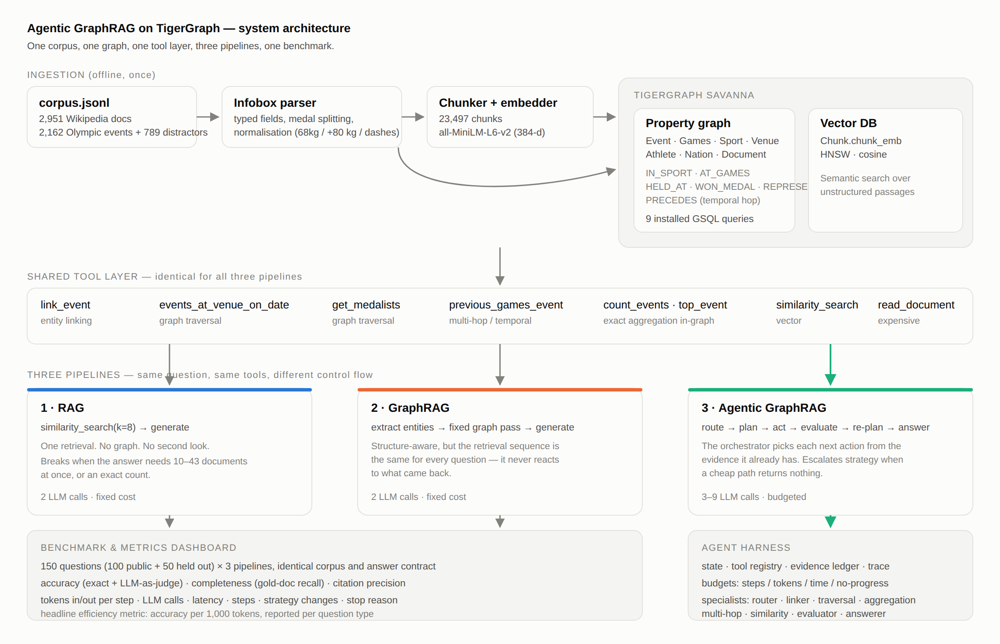
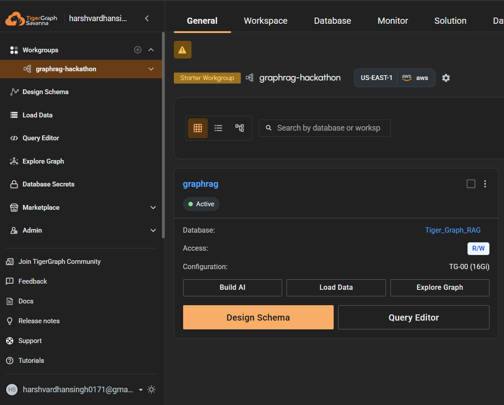
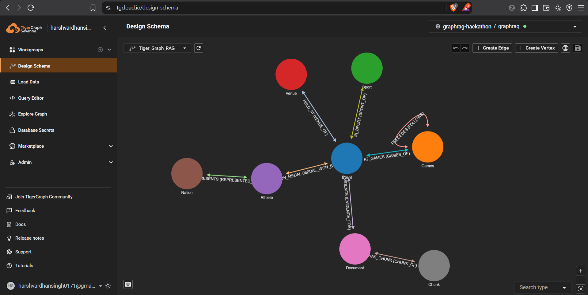
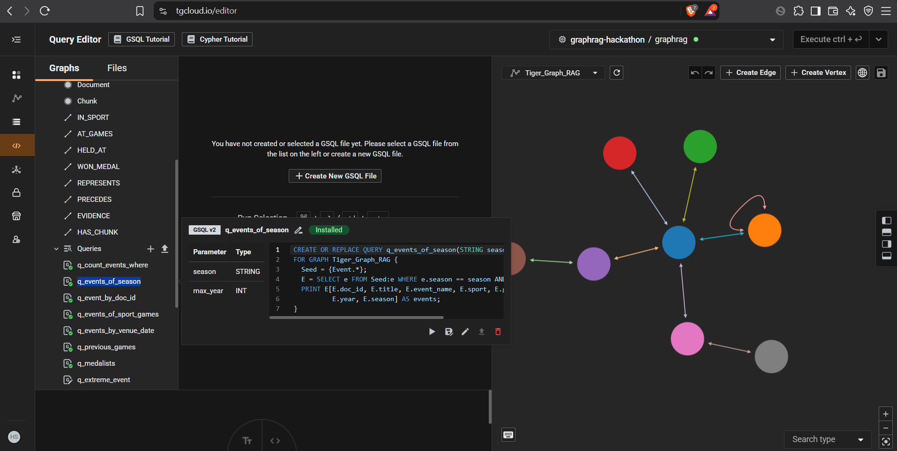

# Agentic GraphRAG on TigerGraph

An agent that answers hard questions over a fixed document corpus by querying a
property graph, searching text, and deciding its own next step. It is benchmarked
side by side against plain RAG and single-pass GraphRAG.

Built for the TigerGraph Agentic GraphRAG Hackathon, Round 1.



---

## What this repo set out to answer

The hackathon does not ask you to make the agent win. It asks:

> figure out which questions need an agent, and which don't.

So the headline here is not one accuracy number. It is a cost/benefit map. For
every question type we report accuracy, how much of the required evidence was
actually read, token cost, and the ratio that decides whether an agent is worth
running: accuracy per 1,000 tokens.

To make that comparison mean something, the three pipelines share one corpus,
one graph, one tool layer and one answer format. The only thing that changes is
the control flow.

| | Retrieval | Reacts to what it finds? | LLM calls |
|---|---|---|---|
| 1 · RAG | vector top-k | no | 2 |
| 2 · GraphRAG | fixed graph pass + vectors | no | 2 |
| 3 · Agentic GraphRAG | chosen step by step | yes | 3–9, budgeted |

---

## Results

Run against a live TigerGraph Savanna workspace, not a local stub:



[Open the interactive dashboard](out/dashboard.html) for every chart below,
broken down by question type. GitHub displays `.html` as source, so to see it
rendered either turn on GitHub Pages for this repo (Settings → Pages → `main` /
root) or download the file and open it. It is one self-contained file, no server
needed.

100 public questions × 4 configurations = 400 graded runs. Model
`gemini-2.5-flash-lite`, embeddings `all-MiniLM-L6-v2`, 0 infrastructure errors.
Reproduce with `make bench-public`. The numbers come from
[`out/public/summary.json`](out/public/summary.json) and hold to about a point
across repeat runs.

| Pipeline | Accuracy | Evidence found | Evidence precision | Tokens/q | Acc/1k tok |
|---|---|---|---|---|---|
| RAG | 43% | 68% | 40% | 2,020 | 0.213 |
| GraphRAG | **97%** | **98%** | 41% | **2,106** | **0.461** |
| Agentic (no router) | 92% | 94% | 94% | 5,393 | 0.171 |
| Agentic (routed) | 93% | 94% | **97%** | 6,442 | 0.144 |

The agent does not win on accuracy. Single-pass GraphRAG is 4 points ahead and
costs a third as much. We are reporting that because it is the answer to the
question the hackathon asked, and the per-type breakdown shows why.

### Where the value is

| Question type | n | RAG | GraphRAG | Agentic |
|---|---|---|---|---|
| aggregation | 21 | 4.8% | 100% | 100% |
| superlative | 10 | 20% | 100% | 100% |
| temporal | 22 | 27% | 100% | 95.5% |
| multi-hop | 28 | 54% | 89% | 82% |
| lookup | 19 | 100% | 100% | 95% |

Read it column by column.

**The graph is worth about fifty points.** Aggregation goes from 4.8% to 100%.
Superlative, 20% to 100%. Temporal, 27% to 100%. That is not a tuning
difference, it is a different category of answer. These questions need 10 to 43
documents at once, or a date relationship the model would otherwise have to
already know. No value of *k* solves that. Typed columns and a `PRECEDES` edge
do.

**The agent adds close to nothing here**, and the same table says why. Every
question type can be answered by a fixed traversal, because all 150 questions
come from five templates. There is nothing for the agent to adapt to. It spends
three to five extra LLM calls per question rediscovering a route that was never
going to change.

> Adaptive retrieval only pays when the route is unknown up front. On a
> benchmark generated from five templates, it never is.

Plain RAG scoring 100% on lookup is the control: the vector store works fine,
the other questions simply outgrow it.

### What the agent does buy: attribution

Accuracy is not the only thing being judged. All three pipelines use one
citation rule — [`harness.CITATION_RULE`](src/agents/harness.py), *cite every
document the system actually read*, not the subset the model claims — and under
that rule a large difference shows up:

| Question type | GraphRAG precision | Agentic precision |
|---|---|---|
| multi-hop | 16% | **100%** |
| temporal | 16% | **100%** |
| lookup | 13% | **85%** |

GraphRAG runs the same traversal whatever you ask it. So it nearly always
reaches the documents that hold the answer (98%), but on a multi-hop question
five out of every six documents it pulls are irrelevant. The agent reaches 94%
of those documents having read almost nothing it did not need.

> The agent does not buy accuracy on this benchmark. It buys attribution: the
> same answers with an evidence trail 2.4× cleaner, because each retrieval was a
> decision instead of a default.

That tells you when to use which. GraphRAG when you want the answer. The agent
when somebody has to check the working.

### The router is a bad trade, and the ablation shows it

The cost-aware router buys one point of accuracy for 19% more tokens: 93%
against 92% without it. On accuracy per 1,000 tokens that is a loss, 0.144
against 0.171. It also abandons its own opening strategy on 11% of questions,
which means the budget it picked was wrong there, and escalating costs more than
starting at the right budget would have.

It ships switched on, with `--ablation` to switch it off, because a feature you
cannot turn off is a feature you cannot evaluate. The fix is visible in the
traces — every escalation is recorded, per strategy — so the budgets could be
learned instead of guessed. That is not implemented.

### The agent says "unknown" instead of guessing

On 5 of the 50 held-out questions the agent finds nothing (entity linking misses
the phrasing) and answers `unknown`. That is on purpose.

Ask the model anyway and it will produce a confident, fluent name from its own
memory rather than from the corpus. An earlier build did exactly that:
`eval-042` answered "Zhang Shan" after two failed lookups, with an empty
citation list. It reads like an answer and is worth nothing, because nothing in
the corpus supports it. It also breaks this project's own instruction to the
model: [never answer from memory, every claim must come from a tool
result](src/agents/prompts.py).

So when the evidence ledger is empty, the orchestrator skips the answering step
and returns `unknown`. This costs nothing in accuracy. Measured across the
public set, zero-evidence guesses were right **1 time in 11**, so abstaining is
the more accurate behaviour as well as the honest one.

The result: every answer in [`out/hidden/submission.jsonl`](out/hidden/submission.jsonl)
that is not `unknown` carries the documents it came from. 45 answered and cited,
5 abstentions, 0 uncited claims.

### How the measurements were kept fair

- **Judge tokens are counted separately** and left out of every pipeline's
  budget, so nothing is charged for being graded.
- **Thinking tokens are included.** Gemini 2.5+ spends part of its output budget
  on hidden reasoning. `thoughtsTokenCount` is in every total here. Leaving it
  out would understate the agent's cost more than any other single choice.
- **Infrastructure failures are reported, not absorbed.** A run that cannot
  reach the database scores as wrong, but is also counted on its own in
  `summary.json → infrastructure_errors`. One earlier run lost 11 of 400 to a
  20-second Savanna outage and every pipeline moved 2 to 3 points. That run is
  not the one reported here.
- **One citation rule across all three pipelines.** An earlier version let each
  pipeline define its own, which quietly made the comparison meaningless. See
  `harness.CITATION_RULE`.
- **[`tests/test_no_overfitting.py`](tests/test_no_overfitting.py)** checks that
  no gold answer and no question id is reachable from any answering code path.

---

## Quick start

```bash
git clone <this repo> && cd agentic-graphrag-tigergraph
make setup                      # install deps, copy .env.example -> .env
# put the hackathon files in data/: corpus.jsonl, eval_public.jsonl, eval_hidden.jsonl

make ingest                     # corpus -> graph tables + text chunks
make vectors                    # embed 23,497 chunks (~30s on CPU)
make test                       # 28 tests, no API key needed
make oracle                     # graph correctness check, expects 100/100
```

Then put your `GEMINI_API_KEY` and TigerGraph credentials in `.env`:

```bash
make deploy                     # schema, data, GSQL queries, vectors -> TigerGraph
make bench-public               # 3 pipelines + ablation x 100 graded questions
make dashboard                  # -> out/dashboard.html
make bench-hidden               # -> out/hidden/submission.jsonl
```

The whole thing also runs offline. `--backend mock` swaps the LLM for a
deterministic rule-based stand-in, so you can exercise the full agent loop
(router, orchestrator, evaluator, answerer) before spending a token:

```bash
python -m src.bench.run --backend mock --graph-backend local --limit 40 --out out/mock
python -m src.bench.dashboard --run out/mock
```

---

## The corpus

Worth reading before looking at any code, because it decided the whole design.

```
corpus.jsonl          2,951 documents, ~5.47M tokens
eval_public.jsonl       100 questions with answers and gold_doc_ids
eval_hidden.jsonl        50 questions, held out
```

| Document kind | Count | Role |
|---|---|---|
| `[Infobox Olympic event]` | 2,162 | where the answers live |
| `[Infobox film]` | 546 | distractor |
| people (officeholder / person / writer / scientist) | 152 | distractor |
| other (tennis events, companies, football and handball competitions, …) | 91 | distractor |

Every Olympic document opens with a machine-readable block:

```
[Infobox Olympic event]
  event: Men's canoe sprint K-2 1,000 metres
  games: 2012 Summer
  venue: Eton Dorney
  date: 6 to 8 August
  competitors: 24
  nations: 12
  gold: Rudolf DombiRoland Kökény
  prev: 2008
  next: 2016
```

All 150 questions can be answered from those fields, in five shapes:

| qtype | public | hidden | what it needs |
|---|---|---|---|
| `aggregation` | 21 | 15 | an exact count over every event of a sport at one Games (10–43 documents) |
| `multi_hop` | 28 | 10 | venue + date → event → medalist |
| `superlative` | 10 | 10 | the maximum over a full set of events |
| `temporal` | 22 | 8 | a hop along `prev` to the preceding Games |
| `lookup` | 19 | 7 | one field of one event |

None of them touch the films or the biographies. Those are there to make naive
vector search noisy, and they succeed.

### Why this decided everything

Aggregation and superlative questions need the complete set of events in one
place at one time. `pub-004` needs all 43 athletics events of 2008 at once. No
top-k retriever returns 43 out of 43, and no language model reliably counts them
if it did. Put the same facts in a graph and it is one query, exact, at a fixed
token cost.

That gave us the rule the whole repo follows:

> Put the facts where they can be computed on, not where they have to be read.

Every infobox field a question might count or compare becomes a typed attribute
on a vertex. The model never counts. It never does arithmetic. It never does
date maths.

---

## The graph

```
POPULATED (what every query traverses)

Event ──IN_SPORT──▶ Sport          Event.competitors : INT
  │   ──AT_GAMES──▶ Games          Event.nations     : INT
  │   ──HELD_AT───▶ Venue          Event.date_norm   : STRING
  └── ──WON_MEDAL─▶ Athlete ──REPRESENTS──▶ Nation
                      (WON_MEDAL.medal, WON_MEDAL.rank)

Games ──PRECEDES──▶ Games          ← temporal questions are one hop

DECLARED BUT NOT POPULATED

Event ──EVIDENCE──▶ Document ──HAS_CHUNK──▶ Chunk(chunk_emb)
```

Live counts after `make deploy`: 2,162 Event, 6,220 Athlete, 303 Venue, 136
Nation, 41 Sport, 20 Games. 8,440 WON_MEDAL, 6,256 REPRESENTS, 2,162 AT_GAMES,
2,162 IN_SPORT, 2,081 HELD_AT, 27 PRECEDES.

About that second block, so nobody has to find it out the hard way: `Document`,
`Chunk`, `EVIDENCE` and `HAS_CHUNK` are declared in
[`gsql/01_schema.gsql`](gsql/01_schema.gsql) but the loading job does not fill
them, so those edges are empty in the live graph. Document text is served by the
local vector index in [`src/vectorstore/`](src/vectorstore/index.py) instead,
because the `chunk_emb` vector attribute was not available on our Savanna build.
The deploy step checks for it and skips cleanly rather than failing — see
[`docs/FEEDBACK.md`](docs/FEEDBACK.md) item 11. `TigerGraphVectorIndex` is
written and wired for a workspace that does support it. We left the schema in
place rather than deleting it quietly, because it is the honest record of what
the design intended and what the platform gave us.

The schema as Savanna draws it:



Two decisions do most of the work:

1. **`competitors` and `nations` are integers on the vertex**, not numbers
   buried in a sentence. Aggregation and superlative become exact operations
   inside the database (`q_count_events_where`, `q_extreme_event`) instead of
   arithmetic handed to a language model.
2. **`PRECEDES` is a real edge**, built from the infobox `prev` and `next`
   fields. "The Olympics held immediately before 2016" is a traversal, not a
   guess. It stays right when Winter and Summer interleave and when a Games is
   missing from the corpus.

Schema, loading job and the nine installed queries are in [`gsql/`](gsql/).

### Three things in the text that cost accuracy

Each of these quietly breaks answers, and each now has a test in
[`tests/test_normalize.py`](tests/test_normalize.py):

| Trap | Example | What it costs |
|---|---|---|
| number and unit run together | `event: Men's 68kg` (2012) vs `Men's 68 kg` (2008) | the temporal hop lands on the wrong Games |
| a stripped `+` | `Men's +80 kg` normalises to `Men's 80 kg` | returns a different event's medalist |
| venue and date collide | `Laura Biathlon & Ski Complex`, 22 Feb 2014 → two events | coin flip on multi-hop |
| date spelling | question says `August 12, 2008`, infobox says `12 August 2008` | retrieval finds nothing at all |

The venue collision is resolved with a signal already in the data: venue names
usually contain their sport, so `Biathlon` in the venue string picks the
biathlon event. The date problem is handled by `date_keys()`, which reduces any
date spelling to the (month, day) pairs it refers to and expands ranges like
`11–17 August`.

---

## The agent

### Harness ([`src/agents/harness.py`](src/agents/harness.py))

Four things, kept independent of any particular LLM or graph backend:

- **state** — plan, strategy, open gaps, failed actions, spend so far
- **tools** — a typed registry with cost hints the orchestrator can read
- **evidence** — an append-only, de-duplicated ledger where every item carries
  its `doc_ids`, so citations come from the investigation rather than from
  whatever the model says at the end
- **stopping** — budgets for steps, tokens and wall clock, plus a no-progress
  detector that fires after two barren steps

### Orchestrator ([`src/agents/orchestrator.py`](src/agents/orchestrator.py))

Each turn it sees the question, a summary of the evidence, the known gaps and
the tool catalogue, and picks one next action. Not a fixed sequence. After any
step that produced something, the evidence evaluator judges whether that is
enough. The loop ends on a sufficiency verdict, a budget, or giving up.

When a cheap strategy comes back empty, the orchestrator escalates: it raises
the budget and widens the toolset. That escalation is written into the trace as
a strategy change, and the dashboard reports it as a rate.

### Specialists ([`src/agents/specialists.py`](src/agents/specialists.py))

Separate single-purpose agents rather than one large prompt, because the
benchmark measures which agents fire on which question type. That signal
disappears if planning, evaluating and answering share a prompt.

`strategy_router` · `entity_linker` · `graph_traversal_agent` ·
`aggregation_agent` · `multi_hop_agent` · `similarity_search_agent` ·
`document_retrieval_agent` · `evidence_evaluator` · `answerer`

### The cost-aware router

Before investigating, the router sorts the question into the cheapest strategy
that can still answer it correctly, and sets the step budget to match:

| strategy | budget | typical question |
|---|---|---|
| `graph_direct` | 3 steps | "how many nations competed in …" |
| `graph_multihop` | 6 steps | "…held at *venue* on *date*" |
| `hybrid` | 8 steps | the graph gets partway, text finishes |
| `document` | 8 steps | the schema cannot express it |

The orchestrator can still escalate past this. The idea is to be agentic where
it matters and cheap everywhere else. As the Results section shows, on this
benchmark it does not pay off, and `AgenticNoRouterPipeline` ships as the
ablation that demonstrates that (`make bench-public` runs both).

---

## Evidence and explainability

Every answer ships with the full trace of how it was reached:

```json
{
  "qid": "pub-001",
  "answer": "5",
  "citations": ["Q47091419", "Q47105341", "..."],
  "tokens": {"input": 2411, "output": 138, "total": 2549, "llm_calls": 3},
  "agentic_trace": {
    "n_steps": 1,
    "tools_called": ["route", "count_events"],
    "agents_invoked": ["aggregation_agent", "strategy_router"],
    "strategy_changed": false,
    "stop_reason": "evidence_sufficient",
    "steps": [{"n": 1, "agent": "aggregation_agent", "action": "count_events",
               "args": {"sport": "biathlon", "year": 2018, "season": "Winter",
                        "field": "competitors", "op": ">", "value": 73},
               "rationale": "exact aggregation belongs in the graph",
               "result_summary": "5 of 11 biathlon events ... have competitors > 73",
               "new_evidence": 1}]
  }
}
```

One deliberate choice: an aggregation answer cites every event the query
scanned, not only the ones that matched. Those documents really were consulted,
and the benchmark's own `gold_doc_ids` agrees.

---

## Verification

Correctness is checked before any LLM is involved.

[`src/bench/oracle.py`](src/bench/oracle.py) drives the graph through the same
tool calls the agent uses, but picks the arguments with regular expressions
instead of a language model. It is not an answering pipeline. It is the check
that the graph loaded correctly and the tool layer returns the right facts. Any
failure here is a data bug, never a prompting bug.

```
$ make oracle
=== GRAPH CORRECTNESS GATE (not a pipeline score) ===
    Checks the graph returns the right facts, with no LLM involved.
    This number must never be reported as system accuracy.
  aggregation   21/21  100.0%
  lookup        19/19  100.0%
  multi_hop     28/28  100.0%
  superlative   10/10  100.0%
  temporal      22/22  100.0%
  TOTAL        100/100 100.0%   <- graph correctness, NOT pipeline accuracy
  gold-doc recall (answer-bearing docs): 100.0%
```

```bash
python -m src.graph.deploy --verify     # same check, against the LIVE database
```

That second command is the one that matters. It runs the gate through
TigerGraph rather than the in-memory store, so a load is never called a success
on vertex counts alone. It is how two real bugs were found: 21/100 at first
(TigerGraph returns attribute names prefixed with the query alias, and the
client was asking for the wrong key), then 98/100 (GSQL vertex sets have no
order, so a team's medalists came back shuffled), then 100/100.

The nine queries installed on the live workspace:



`make test` runs 28 tests covering the text traps, the graph oracle per question
type, and the harness (budgets, no-progress detection, escalation, trace
completeness). No network and no API key.

---

## Metrics

`make dashboard` writes one self-contained `out/dashboard.html`:

- accuracy by question type (exact match, with LLM-as-judge as a fallback)
- how much of the required evidence was found, and how much of what was read
  was actually needed
- token cost per question, split input and output, attributed per step
- accuracy per 1,000 tokens, the number that decides whether the agent is worth
  running
- agent behaviour: tools called, specialists invoked, steps per question type,
  how often the strategy changed, and why the loop stopped

---

## Layout

```
gsql/                   schema, loading job, 9 installed queries
src/ingest/             infobox parser and text normalisation
src/graph/              store interface, LocalGraphStore, TigerGraphStore, deploy
src/vectorstore/        chunk embeddings: local, Gemini, or TigerGraph Vector DB
src/llm/                metered LLM client and the deterministic mock
src/agents/             harness, orchestrator, specialists, tools, prompts
src/pipelines/          rag.py, graphrag.py, agentic.py (+ the router ablation)
src/bench/              oracle, runner, judge, metrics, dashboard
tests/                  28 tests, no network required
docs/architecture.svg   the diagram at the top
docs/FEEDBACK.md        developer feedback on TigerGraph, with repros
```

Both graph backends implement the same interface, so the whole system runs
against TigerGraph or against the in-memory store. That is not a fallback for
its own sake. It is what makes the GSQL testable, because both have to return
the same answers on all 100 public questions, and it is how the `previous_games`
bug was caught.

---

## Reproducing the submission

```bash
make ingest vectors           # deterministic, no API key
make deploy                   # TigerGraph: schema, data, queries, vectors
make bench-public             # graded run + ablation -> out/public/
make dashboard                # -> out/dashboard.html
make bench-hidden             # -> out/hidden/submission.jsonl
```

`out/hidden/submission.jsonl` is one JSON object per held-out question with the
answer, its citations, token counts and the complete agent trace.

---

Corpus text is derived from English Wikipedia, licensed
[CC BY-SA 4.0](https://creativecommons.org/licenses/by-sa/4.0/). Each document
carries its source URL.
